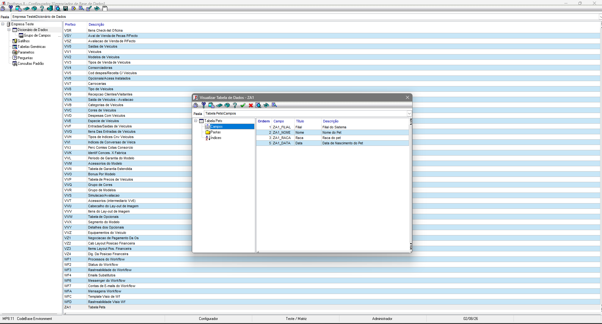

# Exercício 3 - Recriando a ZA1 no Configurador

## Passo a Passo:

1. Abrir o SmartClient e acessar o Configurador (SIGACFG).

2. Acessar o dicionário de dados e criar a tabela ZA1 no SX2(correto, mas criei no configurador).

3. Cadastrar os campos ZA1_FILIAL, ZA1_NOME, ZA1_RACA e ZA1_DTNASC no SX3, definindo o tipo e o tamanho de cada campo.

4. Criar um índice utilizando o campo ZA1_NOME para facilitar a pesquisa dos registros.

5. Executar a rotina de fórmulas apresentada em aula para que o framework reconheça a nova tabela.

6. Abrir o MPSDU e verificar se a estrutura da tabela foi criada corretamente no banco de dados.

7. Caso ocorra algum problema, conferir o caminho dos arquivos, os campos obrigatórios e se o título dos campos respeita o limite permitido pelo Browse.

