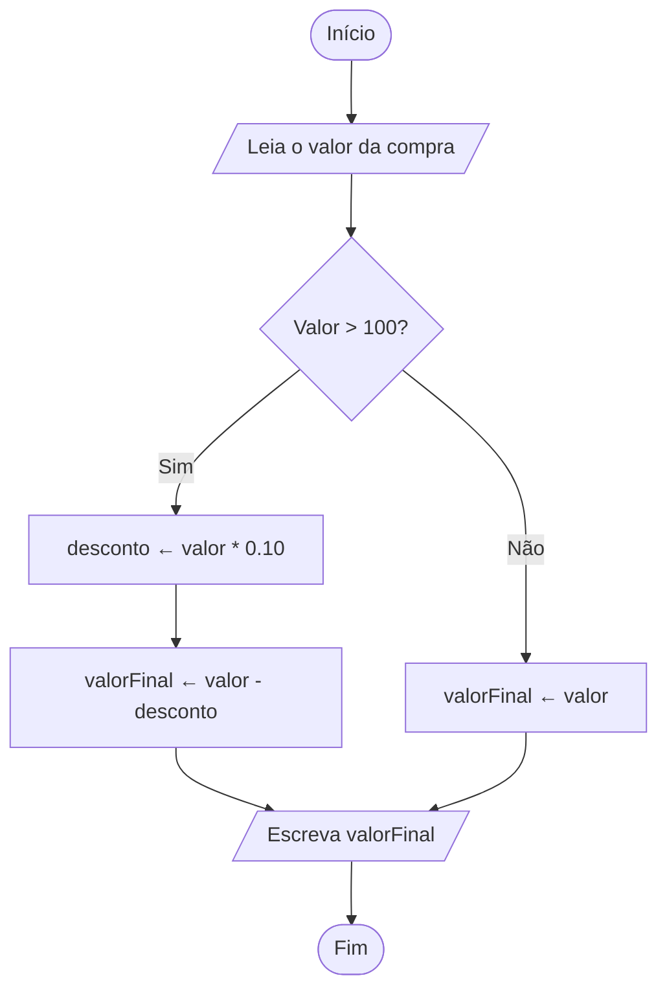

Exercício 3 — Fluxograma (resumo)

Problema: uma loja dá 10% de desconto para compras acima de R$ 100.

Pseudocódigo curto
Início
Leia valorCompra
Se valorCompra > 100 então
    desconto <- valorCompra * 0.10
    valorFinal <- valorCompra - desconto
Senão
    valorFinal <- valorCompra
Fim
Escreva valorFinal
Fim

Fluxograma (texto resumido)
Início → Leia valorCompra → (Valor > 100?)
- Sim: desconto ← valorCompra * 0.10 → valorFinal ← valorCompra - desconto
- Não: valorFinal ← valorCompra
→ Escreva valorFinal → Fim

Fluxograma (Mermaid)

